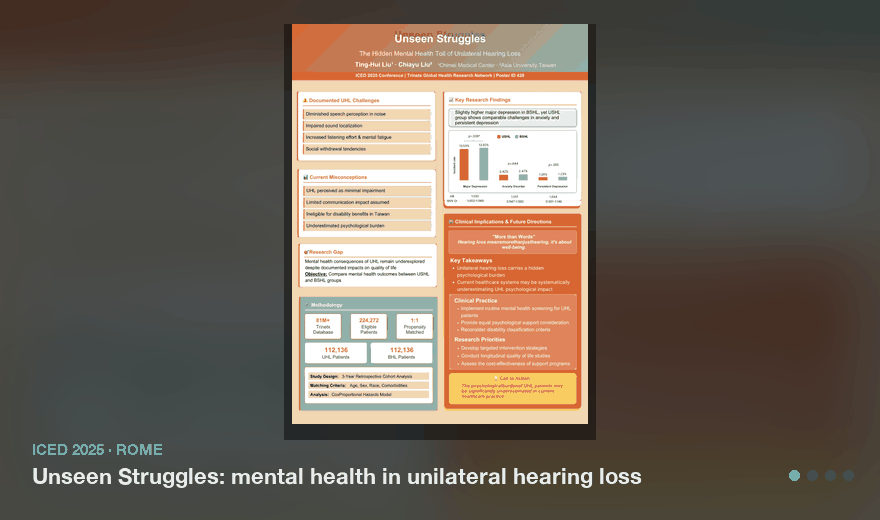
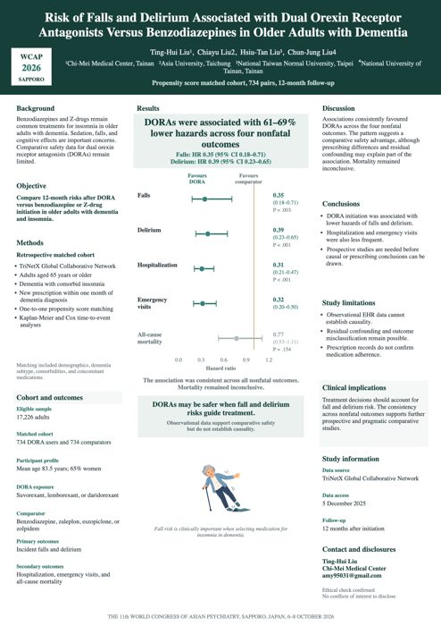
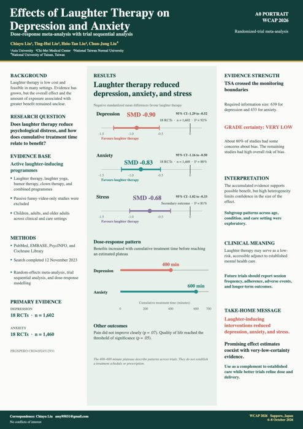
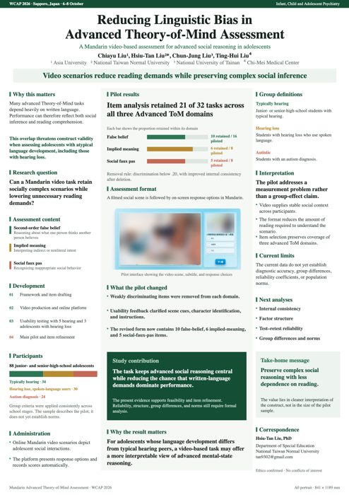
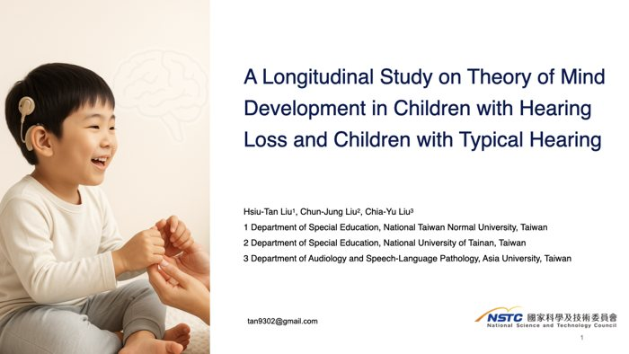
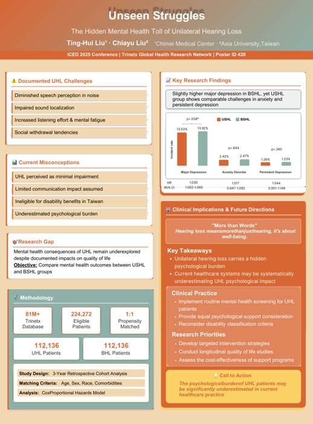
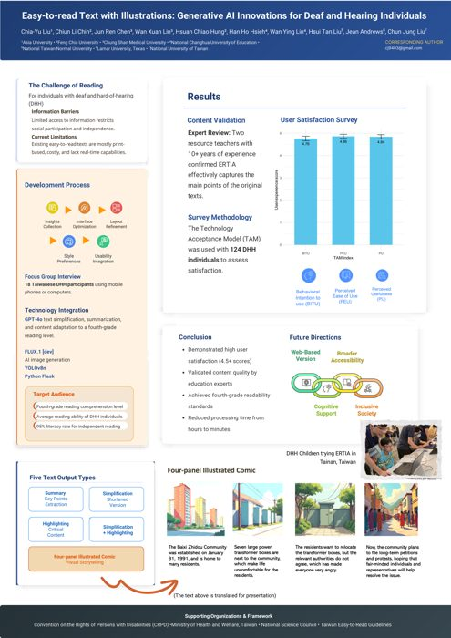
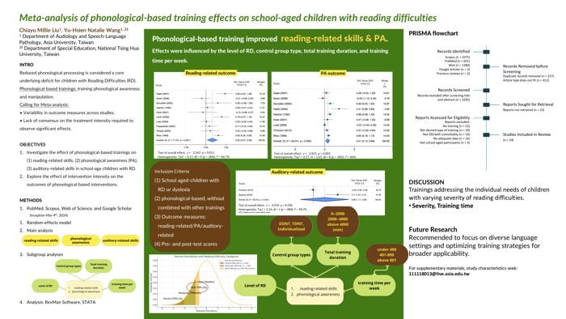
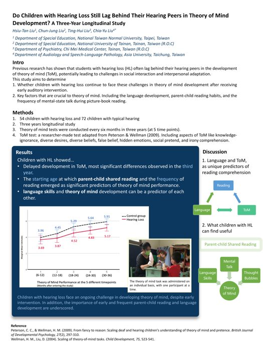
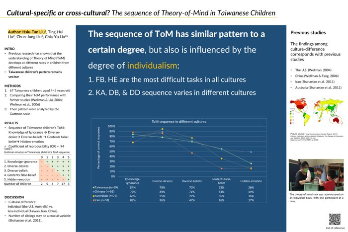

# 🖼️ Conference posters & talks

<p align="center">
  <a href="https://amy95031.github.io/conference-posters/">
    
  </a>
</p>

<p align="center">
  <a href="https://amy95031.github.io/conference-posters/"></a>
</p>

Posters and talks by **Chia-Yu (Millie) Liu** on hearing loss, dementia, child language, and cognition. The [interactive gallery](https://amy95031.github.io/conference-posters/) lets you filter by topic, open each poster full screen, and zoom in to read the details.

| | Poster | Meeting |
|---|---|---|
|  | **Risk of Falls and Delirium Associated with Dual Orexin Receptor Antagonists Versus Benzodiazepines in Older Adults with Dementia**<br/>Ting-Hui Liu, Chia-Yu Liu, Hsiu-Tan Liu, Chun-Jung Liu | WCAP 2026 · Sapporo, Japan · 6–8 Oct 2026 (upcoming) |
|  | **Effects of Laughter Therapy on Depression and Anxiety: Dose-response Meta-analysis with Trial Sequential Analysis**<br/>Chia-Yu Liu, Ting-Hui Liu, Hsiu-Tan Liu, Chun-Jung Liu | WCAP 2026 · Sapporo, Japan · 6–8 Oct 2026 (upcoming) |
|  | **Reducing Linguistic Bias in Advanced Theory-of-Mind Assessment**<br/>Chia-Yu Liu, Hsiu-Tan Liu, Chun-Jung Liu, Ting-Hui Liu | WCAP 2026 · Sapporo, Japan · 6–8 Oct 2026 (upcoming) |
|  | **🎤 Oral: A Longitudinal Study on Theory of Mind Development in Children with Hearing Loss and Children with Typical Hearing**<br/>Hsiu-Tan Liu, Chun-Jung Liu, Chia-Yu Liu · 22 slides, view in the gallery | ICED 2025 · Rome, Italy · Oral #172 |
|  | **Unseen Struggles: The Hidden Mental Health Toll of Unilateral Hearing Loss**<br/>Ting-Hui Liu, Chia-Yu Liu | ICED 2025 · Rome, Italy · Poster #428 |
|  | **Easy-to-read Text with Illustrations: Generative AI Innovations for Deaf and Hearing Individuals**<br/>Chia-Yu Liu, et al. | ICED 2025 · Rome, Italy · Poster #219 |
|  | **Meta-analysis of Phonological-based Training Effects on School-aged Children with Reading Difficulties**<br/>Chia-Yu (Millie) Liu, Yu-Hsien (Natalie) Wang | ASHA Convention 2024 · Seattle, USA |
|  | **Do Children with Hearing Loss Still Lag Behind Their Hearing Peers in Theory of Mind Development? A Three-Year Longitudinal Study**<br/>Hsiu-Tan Liu, Chun-Jung Liu, Ting-Hui Liu, Chia-Yu Liu | ICP 2024 · Prague, Czech Republic |
|  | **Cultural-specific or Cross-cultural? The Sequence of Theory-of-Mind in Taiwanese Children**<br/>Hsiu-Tan Liu, Ting-Hui Liu, Chun-Jung Liu, Chia-Yu Liu | APA 2023 · Washington, DC, USA |

## Repository layout

```
index.html            interactive gallery (GitHub Pages, no build step)
posters/              full-size poster images
thumbs/               thumbnails
talks/                slide images for oral presentations
gallery-preview.gif   animated preview used in this README and on my profile
```

Participant images in the theory-of-mind assessment poster are blurred for privacy. Poster content © the respective authors. Please cite the original presentations when referring to this work.
